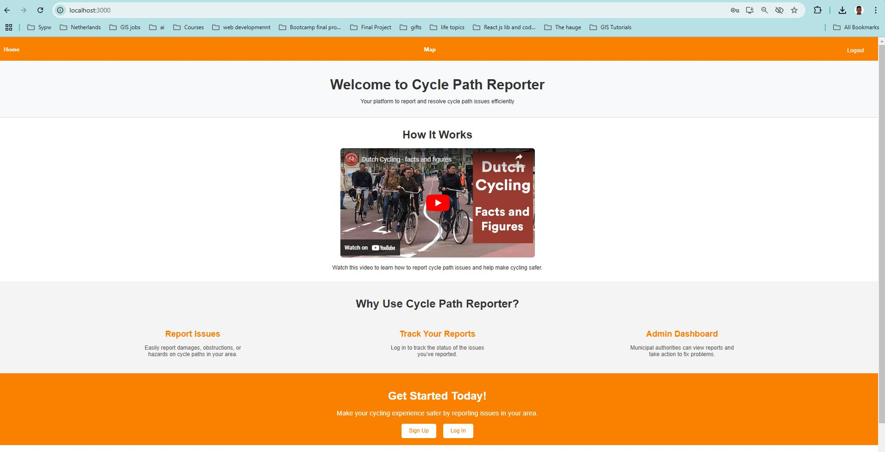
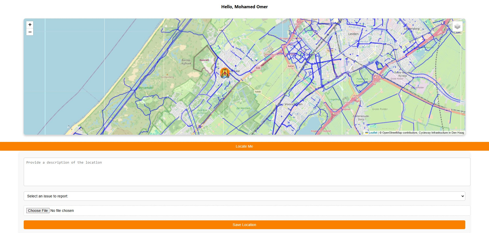
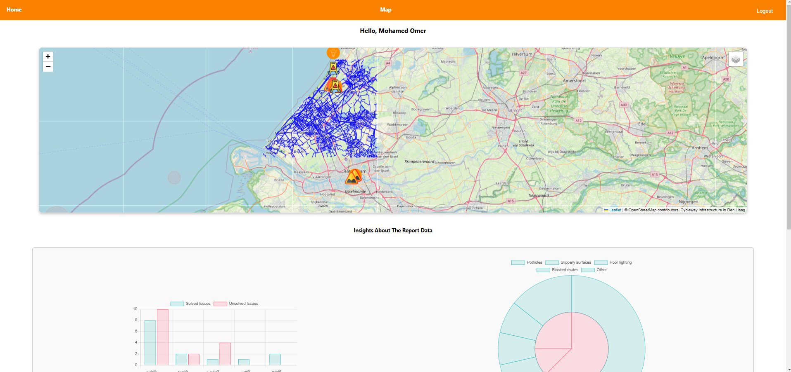
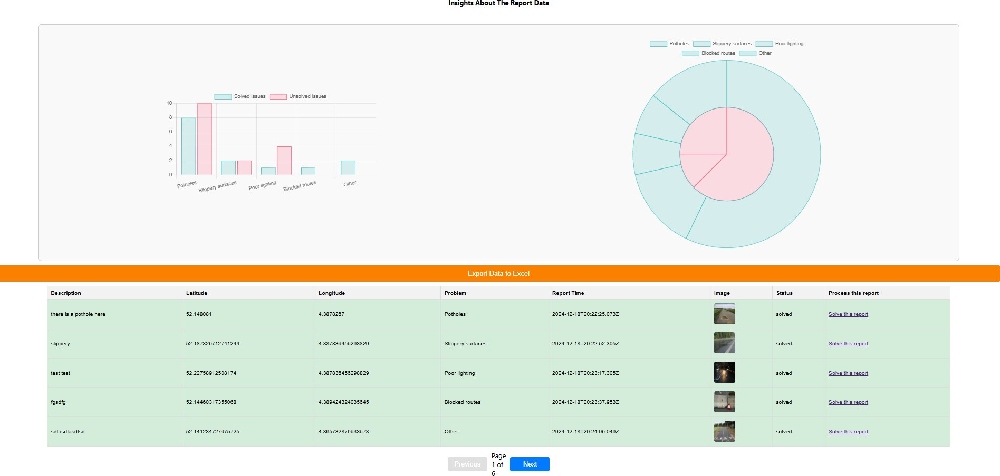
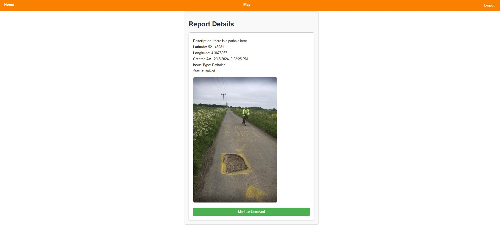

# Cycle Path Reporter

### *Fietspad Meldingen*

> A full-stack web platform that lets cyclists report issues on cycling paths in the Netherlands — potholes, slippery surfaces, poor lighting, blocked routes — and gives municipalities a real-time map and dashboard to monitor and resolve them.


---

## Table of Contents

- [About the Project](#about-the-project)
- [Features](#features)
- [Screenshots](#screenshots)
- [Tech Stack](#tech-stack)
- [Project Structure](#project-structure)
- [Getting Started](#getting-started)
- [API Reference](#api-reference)
- [Roadmap](#roadmap)
- [Team](#team)
- [License](#license)
- [Acknowledgements](#acknowledgements)

---

## About the Project

**Cycle Path Reporter** (*Fietspad Meldingen* in Dutch) turns everyday cyclists into the eyes and ears of road maintenance. Spot a pothole, slippery section, broken light, or a route blocked by works? Drop a pin on the map, snap a photo, pick a category, and submit. Your report lands instantly in a municipal dashboard where administrators can review it, see clusters on the map, and mark it as resolved once the issue is fixed.

The platform overlays user reports on top of the live cycleway-infrastructure dataset for the Den Haag region (sourced from OpenStreetMap), making it easy to spot recurring problem zones along specific cycling routes.

---

## Features

### For cyclists

- **Interactive map** of the Den Haag region with the full cycleway network rendered live
- **"Locate Me"** button to drop a pin at the user's current GPS position
- **Categorised reporting** — Potholes, Slippery surfaces, Poor lighting, Blocked routes, Other
- **Photo upload** for visual evidence of the issue
- **Description field** for additional context
- **Personal account** — sign up, log in, and track your reports

### For municipalities

- **Admin map view** with every report rendered as a marker
- **Insights dashboard** with two live charts:
  - Bar chart: solved vs. unsolved issues per category
  - Donut chart: overall breakdown of issue types
- **Sortable, paginated reports table** with status, coordinates, timestamp, and image preview
- **One-click "Solve this report"** workflow
- **Export to Excel** for further analysis or archiving

### Authentication

- Separate citizen and administrator roles
- Sign-up and log-in flow
- Protected admin routes

---

## Screenshots

### Landing page

A clear entry point introducing the platform, with a "How It Works" video and quick links to sign up or log in.



### Submitting a report

Cyclists locate themselves on the map, write a short description, pick the type of issue, and attach a photo before saving the report.



### Map and insights

The combined view showing every report on the map of the Den Haag cycleway network alongside aggregate insights.



### Admin dashboard

Charts summarising solved vs. unsolved issues per category, plus a paginated table of every report with one-click resolution and Excel export.



### Report details

Each report opens to a dedicated page showing description, coordinates, timestamp, issue type, status, the attached photo, and a toggle to mark it as solved or unsolved.



---

## Tech Stack

**Frontend — `fietspad-meldingen-app`**
- React
- [Leaflet](https://leafletjs.com/) — interactive maps
- [OpenStreetMap](https://www.openstreetmap.org/) — basemap tiles
- Chart.js — dashboard visualisations
- HTML5 / CSS3

**Backend — `fietspad-meldingen-api`**
- Node.js
- Express.js
- [Database —  MongoDB / PostgreSQL]
- Geoserver
- RESTful API architecture

**Data sources**
- Cycleway Infrastructure for the Den Haag region (OpenStreetMap)

**Tooling**
- Git & GitHub for version control
- npm for package management


---

## Project Structure

```
fietspad-meldingen/
├── Group-17/                     # Project documentation & deliverables
├── fietspad-meldingen-api/       # Back-end REST API
│   ├── routes/
│   ├── models/
│   ├── controllers/
│   └── package.json
├── fietspad-meldingen-app/       # Front-end React client
│   ├── public/
│   ├── src/
│   └── package.json
└── docs/
    └── screenshots/              # Screenshots used in this README
```

---

## Getting Started

### Prerequisites

- [Node.js](https://nodejs.org/) (v18 or higher)
- [npm](https://www.npmjs.com/) (bundled with Node.js)

### Installation

**1. Clone the repository**

```bash
git clone https://github.com/MohamedGamalGeo/fietspad-meldingen.git
cd fietspad-meldingen
```

**2. Set up the API**

```bash
cd fietspad-meldingen-api
npm install
```

Create a `.env` file in the API folder:

```env
PORT=5000
DB_URI=your_database_connection_string
JWT_SECRET=your_jwt_secret
```

Start the API:

```bash
npm start
```

**3. Set up the frontend**

In a new terminal:

```bash
cd fietspad-meldingen-app
npm install
npm start
```

The app runs at **http://localhost:3000** and connects to the API.

---

## API Reference

| Method | Endpoint                  | Description                          | Auth     |
| ------ | ------------------------- | ------------------------------------ | -------- |
| POST   | `/api/auth/register`      | Register a new user                  | Public   |
| POST   | `/api/auth/login`         | Log in and receive a token           | Public   |
| GET    | `/api/meldingen`          | Retrieve all reports                 | Required |
| GET    | `/api/meldingen/:id`      | Retrieve a single report             | Required |
| POST   | `/api/meldingen`          | Create a new report (with image)     | Required |
| PUT    | `/api/meldingen/:id`      | Update a report's status             | Admin    |
| DELETE | `/api/meldingen/:id`      | Delete a report                      | Admin    |
| GET    | `/api/meldingen/export`   | Export all reports as Excel          | Admin    |

**Example — create a new report**

```http
POST /api/meldingen
Content-Type: multipart/form-data
Authorization: Bearer <token>

description: "There is a pothole here"
problem: "Potholes"
latitude: 52.148081
longitude: 4.3878267
image: <file>
```

> Adjust endpoints and payloads to match your actual implementation.

---


## Team

This project was developed as **Group 17** for *[Full Stack MERN Bootcamp]* at *[Matrix Maste]*.

| Name | Role | GitHub |
| ---- | ---- | ------ |
| Mohamed Omer| *[Role — Backend Developer & Web GIS Developer]* | [@MohamedGamalGeo](https://github.com/MohamedGamalGeo) |


---

## License

Distributed under the MIT License. See `LICENSE` for more information.

---

## Acknowledgements

- [OpenStreetMap](https://www.openstreetmap.org/) contributors for the basemap and cycleway data
- [Leaflet](https://leafletjs.com/) for the mapping library
- [Geoserver](https://geoserver.org/) for WMS Publishing
- *[Full Stack MERN Bootcamp - Matrix Maste ]*

---

<p align="center">Made by <strong>Group 17</strong></p>
